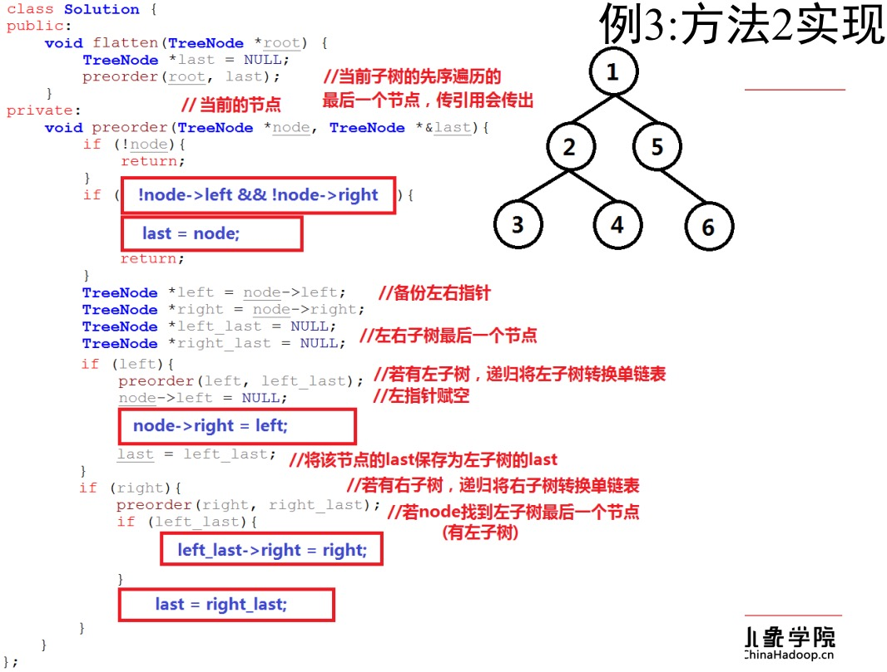
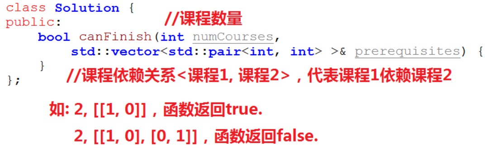

### 例3：算法思路（方法2整体）

>  递归最大的魅力就在于：我们不需要搞清楚递归里面怎么做的的过程，我们只需要搞清楚完成这件事怎么做。


递归解决了你很难以想清楚的问题，你只需要想清楚几件事：

1、进入递归之前做些什么；

2、完成递归之后做些什么。


---

### 例3：算法思路（拆解并解决子问题）


---

### 例3：算法思路（解决当前问题）


---

### 例3：方法2实现



---

### 例3：测试与leetcode提交结果


---


## 预备知识：二叉树层次遍历

二叉树层次遍历，又称为宽度优先搜索，按书的层次一次访问树的结点。层次遍历使用队列对遍历节点进程存储，先进入队列的结点，优先遍历拓展其左孩子与右孩子。

>设置队列Q
>
>将根节点push进Q
>
>while(Q不空) {
>
>​	取出队列头部节点node
>
>​	对node访问
>
>​	将node的左、右孩子push进队列
>
>}

```

					a1
				  / \
				b2   c5
			 /  \    \
			d3   e4   f6
			层次遍历：
			a(1),b(2),c(5),d(3),e(4),f(6)
```

---

### 预备知识：二叉树层次遍历


---

### 预备知识：二叉树层次遍历，课堂练习


---

### 预备知识：二叉树层次遍历，实现


---


## 例4：侧面观察二叉树

给定一个二叉树，假设从该二叉树的右侧观察它，将观察到的节点按照从上到下的顺序输出。


选择LeetCode 199. Binary Tree Right Side View

https://leetcode.com/problems/binary-tree-right-side-view/description/

难度：Medium

---

### 例4：思考与分析

从二叉树的右侧观察它，将观察到的节点按照从上到下的顺序输出，就是求层次遍历二叉树，每个层中的最后一个节点。


思考：层次遍历时，如何记录每一层中出现的最后一个节点？

---

### 例4：算法思路

层次遍历时，将节点与层数绑定为pair，压入队列时，将节点与层数同时压入队列，并记录每一层中出现的最后一个节点。

在层次遍历中，每一层中的最后一个节点最后遍历到，随时更新对每层的最后一个节点即可。


---

### 例4：课堂练习


---

### 例4：实现


---

### 例4：测试与leetcode提交结果


---


## 预备知识：图的定义

图（Graph）是由顶点的有穷非空集合和顶点之间边的集合组成，通常表示为：G(V, E)，其中，G表示一个图，V是图G中顶点的集合，E是图G中边的集合。

图分无向图和有向图，根据图的边长，又分带权图与不带权图。


> 我们后面考虑的深搜和广搜指的都是不带权图。

很多跑出来的算法都是用邻接矩阵跑的，比如说最小生成树，最短路径。

搜索的话，一般是用邻接表。

---

### 预备知识：图的构造与表示（邻接矩阵）


---

### 预备知识：图的构造与表示（邻接表）


---


## 预备知识：图的深度优先遍历

从图中某个顶点v出发，首先访问该顶点，然后依次从它的各个未被访问的邻接点出发深度优先搜索遍历图，直至图中所有和v有路径相通且未被访问的顶点都被访问到。若此时尚有其他顶点未被访问到，则另选一个未被访问的顶点作起始点，重复上述过程，直至图中所有顶点都被访问到为止。


---

### 预备知识：图的深度优先遍历，课堂练习


---

### 预备知识：图的深度优先遍历，实现


深度和宽度遍历的 复杂度都是O(n)。

---


## 预备知识：图的宽度优先遍历

从图中某个顶点v出发，在访问了v之后一次访问v的各个未曾访问过的邻接点，然后分别从这些邻接点出发一次访问它们的邻接点，并使得”<u>先被访问的顶点的邻接点</u>  **先于**  <u>后被访问的顶点的领接点</u>被访问“，直至图中所有已被访问的顶点的邻接点都被访问到。如果此时图中尚有顶点未被访问，则需要另选一个未曾被访问的顶点作为新的起始点，重复上述过程，直至图中所有顶点都被访问到为止。


---

### 预备知识：图的宽度优先遍历，课堂练习


---

### 预备知识：图的宽度优先遍历，实现


---

## 例5：课程安排

一直有n个课程，标记从0至n-1，课程之间是有依赖关系的，例如希望完成A课程，可能需要先完成B课程。已知n个课程的依赖关系，求是否可以将n个课程全部完成。



选自 LeetCode 207.Course Schedule

https://leetcode.com/problems/course-schedule/description/

难度：Medium

---

### 例5：分析

n个课程，它们之间有m个依赖关系，可以看成顶点个数为n，边个数为m的有向图。

图1：n =3，m=[[0, 1], [0, 2], [1, 2]]; 可以完成。

图2：n = 3， m=[[0, 1], [1, 2], [2, 0]]; 不可以完成。

故，若有向图无环，则可以完成全部课程，否则不能。问题转换成，构建图，并判断图是否有环。


---

### 例5：方法1，深度优先搜索

在深度优先搜索时，如果装在搜索某一顶点（还未退出该顶点的递归深度搜索），又回到了该顶点，即证明图有环。


---

### 例5：算法思路（无环）


---

### 例5：算法思路（无环）


---

### 例5：算法思路（有环）


---

### 例5：方法1，代码


---

### 例5：方法1，课堂练习


---

### 例5：方法1，实现


---

## 例5：方法2，拓扑排序（宽度优先搜索）

在宽度优先搜索时，只将入度为0的点添加至队列。当完成一个顶点的搜索（从队列取出），它指向的所有顶点入度都减1，若此时某顶点入度为0则添加至队列，若完成宽度搜索后，所有的点入度都为0，则图无环，否则有环。


---

### 例5：算法思路（无环）


---

### 例5：算法思路（有环）


---

### 例5：方法2，课堂练习


---

### 例5：方法2，实现


---

【完】