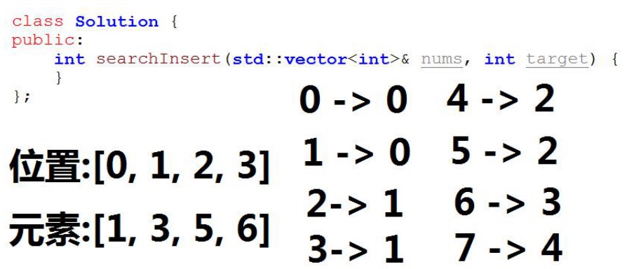

当写程序时，如果发现有分治思想，你会发现，很容易就写出循环。如果有回溯，写递归就可以了。

# 第六课 二分查找与二叉查找树

## 内容概述

1.5道经典二分搜索与二叉查找（排序）树的相关题目

​	预备知识：二分查找基础知识

​	例1：插入位置（easy）（二分查找）

​	例2：区间查找（medium）（二分查找）

​	例3：旋转数组查找（medium）（二分查找）

​	预备知识：二叉查找（排序）树编码与解码（medium）

​	例4：二叉查找树编码与解码（medium）

​	例5：逆序数（hard）（二叉查找树应用）

2.详细讲解题目解题方法、代码实现

---

## 预备知识：二分查找

已知一个排序树组A，如A = [-1, 2, 5, 20, 90, 100, 207, 800],

另外一个乱序数组B，如B = [50, 90, 3, -1, 207, 80],

求B中的任意某个元素，是否在A中出现，结果存储在数组C中，出现用1代表，未出现用0代表，如C = [0, 1, 0, 1, 1, 0]。

思考，最暴力的方法复杂度是多少？有没有更快的方法？

---

### 预备知识：二分查找算法

二分查找又称折半查找，首先，假设表中元素时按升序排列，将表中间位置的关键字与查找关键字比较：

1. 如果两者相等，则查找成功；

2. 否则利用中间位置将表分成前、后两个子表：

   1）如果中间位置的关键字大于查找关键字，则进一步查找前一子表；

   2）否则进一步查找后一子表。

重复以上过程，直到找到满足条件的记录，使查找成功，或直到子表不存在为止，此时查找不成功。

例如，待搜素数字target == 2， 200

数组A= [-1, 2, 5, 20, 90, 100, 207, 800]

---

### 预备知识：二分查找算法

---

### 预备知识：二分查找算法

---

### 预备知识：二分查找（递归），课堂练习

---

### 预备知识：二分查找（递归），实现

---

### 预备知识：二分查找（循环），课堂练习

---

### 预备知识：二分查找（循环），实现

---

---

## 例1：插入位置

给定一个排序数组nums（无重复元素）与目标值target，如果target在nums里出现，则返回target所在下标，如果target在nums里未出现，则返回target应该插入位置的数组下标，使得将target插入数组nums后，数组仍有序。

选自 LeetCode 35. Search Insert Position

https://leetcode.com/problems/search-insert-position/description/

难度：Easy

---

### 例1：思考

1. 当target在nums中出现时，二分查找的流程无变化。

2. 当target在nums没有出现时：

   1）如果target < nums[mid]，且target > nums[mid - 1]；说明了什么？

   2）如果target > nums[mid]，且target < nums[mid + 1]；说明了什么？

3. 当mid == 0或者mid == nums.size() - 1 时，这样的边界条件，应该如何处理？

---

### 例1：算法思路

设元素所在的位置（或最终需要插入的位置）为index，在二分查找的过程中：

如果target == nums[mid]：index = mid;

如果target < nums[mid]，且（mid == 0或target > nums[mid - 1]）:index = mid;

如果target > nums[mid]，且（mid == nums.size() - 1或target < nums[mid + 1]）:index = mid + 1;

---

### 例1：算法思路

---

### 例1：课堂练习

---

### 例1：实现

---

### 例1：测试与leetcode提交结果

---

---

